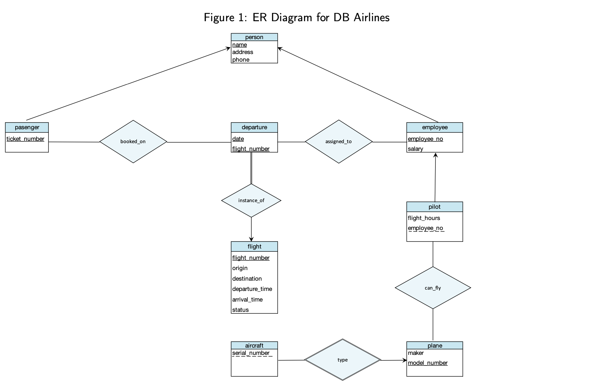
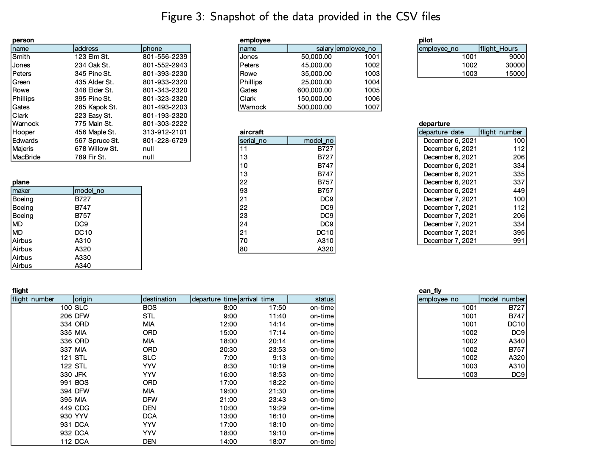

Concepts Demonstrated:

• Reducing an ER Diagram into tables

• Inserting data into a database

• Coding/presenting work in a Jupyter notebook

• Inserting record(s) into a database table

• Creating and verifying a trigger on a database table

• Writing and testing a stored procedure on a database

• Issuing SQL statements on a database

